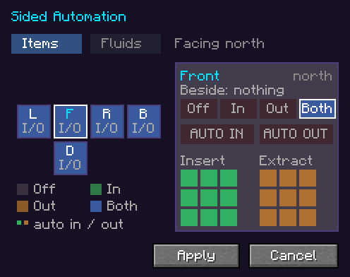

---
navigation:
  title: Side configuration
  parent: concepts/index.md
  position: 5
---

# Side configuration

Quantimium's automated machines let you decide, face by face, what pipes, hoppers and neighbouring
machines can put in and take out. The same editor, **Sided Automation**, is used on every machine
that has one, and a wrench can change it without opening anything.

| Machine | Items | Fluids | Faces |
| --- | --- | --- | --- |
| [Quantum Crafter](../machines/quantum-crafter.md) | Yes | No | All six |
| [Quantum Simulator](../machines/quantum-simulator.md) | Yes | Yes | All but the top (the field) |
| [Tesseract Stabiliser](../machines/tesseract-stabilizer.md) | Yes | Yes | All but the top |

The Basic Quantum Crafter has no side configuration: every face is both an input and an output.

## Opening the editor

Every one of them has a **hopper tab** down the right of its screen.

## Faces

The six faces are laid out as an unfolded cube around the **Front**:
Left, Front, Right and Back across the middle, Top above and Down below. They are named from the
machine's own facing, not the compass, because every side of the block looks alike. Hover a face to
see its world direction and the block beside it; the selected face's pane shows both too
(*Beside*).

A face the machine can't automate (a Simulator's top) is left out of the net.

## Modes

Each face has a **mode** for items and, separately, for fluids (switch with
the **Items** and **Fluids** tabs):

| Mode | Things can go in | Things can come out |
| --- | --- | --- |
| **Off** | No | No |
| **In** | Yes | No |
| **Out** | No | Yes |
| **Both** | Yes | Yes |

The face tiles are coloured by mode: dark for Off, green for In, orange for Out and blue for Both.
Click a tile to edit that face in the pane on the right, or right-click it to cycle its mode.

| Machine | Items start as | Fluids start as |
| --- | --- | --- |
| Quantum Crafter | Both | (no fluids) |
| Quantum Simulator | Both | Off |
| Tesseract Stabiliser | Both | Both |

## Which slots a face reaches

Under the mode buttons, the **Insert** and **Extract** grids choose which
slots the face works on. Click a cell to allow or block it.

- **Insert** covers the nine input slots of the grid.
- **Extract** covers the nine output slots. The Quantum Crafter's output grid has six pages of nine;
  each cell stands for that position on **every** page.
- On the **Fluids** tab the cells are the three input tanks and the three output tanks.
- A Tesseract Stabiliser has no slots of its own; its faces reach *all remote slots* the link
  exposes.

**Example.** A Simulator running a furnace, mapped so the odd grid slots take ore and the even
slots take fuel: set the top-facing hopper's face to **In** with only the odd cells, and a side face
to **In** with only the even cells. Ore and coal then arrive in the right slots from two hoppers.

## Automatic transfer

**Auto In** and **Auto Out** make a face move things by itself, without a
pipe. Once a second, a face with:

- **Auto In** pulls from the block beside it into the slots its Insert cells allow;
- **Auto Out** pushes from the slots its Extract cells allow into the block beside it.

Auto In needs a mode that allows input (In or Both), and Auto Out one that allows output. Two small
dots on a face tile show which of the two it has on.

On a Quantum Crafter, Auto Out **commits a craft** and pushes it, sized to the room the neighbour
has; see [Automation](../machines/quantum-crafter.md).

## Apply or cancel

Changes in the editor are only saved when you press **Apply**. **Cancel**, or Escape, leaves the
machine as it was.

## With a wrench

Right-click a face of the machine with any wrench (any item in the
`#c:tools/wrench` tag, such as those from Modern Industrialization or Mekanism):

- **Click:** cycle that face's **item** mode: Off → In → Out → Both → Off.
- **Sneak-click:** cycle its **fluid** mode.

The wrench only changes the mode. Slot cells and auto transfer stay in the editor. A sneak-click
never dismantles or rotates a Quantimium machine, whatever the wrench does elsewhere.
