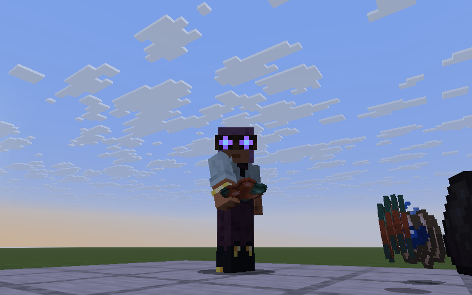
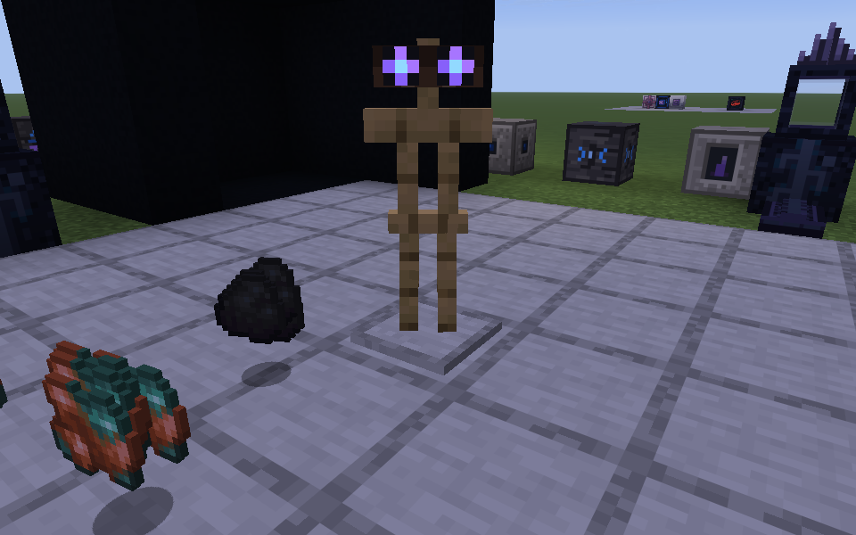

---
navigation:
  title: Mirror Lens
  parent: items/index.md
  position: 9
  icon: quantimium:mirror_lens
item_ids:
- quantimium:mirror_lens
---

# Mirror Lens

<ItemImage id="quantimium:mirror_lens" scale="2" />

> *In game:* Worn, it lets the mirror show through: the field, and what lives in it

Goggles that let a slice of the mirror into the real world. Wear them in the head slot and the
[field](../concepts/flux-and-anomaly.md) around you shows, not as numbers but as weather: air that
thickens, rare plumes worth stopping for, and anomaly as a dark ink that pools, leaks and is drawn into
whatever eats it. Through the lens it is toned down; inside the [mirror](../concepts/mirror-phase.md)
you see all of it without one, far more intense.

Once a second you see the field of the chunks round you, four chunks out,
fading gently from two chunks away so nothing pops in at an edge.
In the mirror the same view is always on, lens or not.

## Flux is weather

- **Haze.** A low azure haze hangs over the ground, deeper the hotter the chunk, with slow veils above
  it and specks drifting through. Most of the sense that a chunk is heavy comes from this.
- **Plumes.** Now and then the ground seam glows, then a column erupts: about 3 blocks tall at Medium,
  7 at High, 14 at Critical and 24 at Singularity, with a bright core, embers thrown off the hotter
  ones, and a head that blooms and drifts away. Across the chunks round you, about one every ten
  seconds at Medium, up to one a second at Singularity.
- **Sparks.** From High, sparks wink into existence on the floors round you and fade, as if the ground
  itself were charged.
- **Contained.** Under a [hall](../multiblocks/containment-hall.md)'s containment a plume gets three
  blocks up and meets the field: it flattens and spreads along a faint glowing membrane.

## Anomaly is ink

- **Ink.** Dark violet smoke seeps up and settles low, denser the higher the band, with bright specks
  snapping about inside it.
- **Cracks.** From High, bright lines flicker in the air, bleeding ink.
- **Vortices.** From Critical, ink and specks fall upward into a point.

## Feeders and drains

Anything feeding the field exhales it: faster, higher and thicker the more it
emits, so a furnace simulator shows as a wisp and a <ItemLink id="quantimium:quantum_exciter" /> as a fountain. Its flux
is azure; a general machine's quarter share of anomaly trails as ink, while pure emitters (generators,
<ItemLink id="quantimium:rift_stabiliser" />s) stay clean. A <ItemLink id="quantimium:decoherence_projector" /> lashed by a rift bursts with it.

Every rift bleeds ink from its tear, held or not, and
Anomalite crystals brood in a pool of their own, bigger as they grow.
These show what a rift and a crystal are; they add nothing to the field.

Anything drawing the field out, a <ItemLink id="quantimium:flux_suppressor" />, a siphon, a hall, pulls the ink in from
all round it along spirals, so you can see which one is working and how far it reaches.

## The readout

While you can see the field, a small panel in the corner of the screen reads the chunk you stand in: a
bar for flux in azure and one for anomaly in violet, each filled on the band scale with a tick at every
band boundary and the band named at the end. The bars ease to each new reading and pulse from
Critical. Under containment a tag shows how full it is: **Contained** with its load, or **Overloaded**
past 100%. It steps aside for
F1 and F3.

## Worn

The goggles show on your head: a leather strap round it at eye level with a buckle at the back, and two
rimmed violet lenses that catch a little light in the dark. Armour stands wear them too.

## It notices

Through the lens the [Veiled](../mechanics/veiled.md) shows where it
really stands, faint. Stare at it and it becomes curious how you can see it, and follows you; while
you wear the lens its sightings also come twice as often.

## Settings

In the `fieldVision` config, `density` scales how much is drawn (1 by default, 0 for none; the game's
particle setting thins it further), `hud` turns the readout off, and `hudCorner` moves it to any corner.
The lens needs no power.

## Recipes

<RecipesFor id="quantimium:mirror_lens" />
