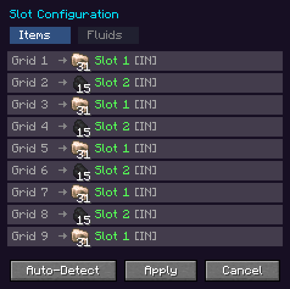

---
navigation:
  title: Quantum Simulator
  parent: machines/index.md
  position: 10
  icon: quantimium:quantum_simulator
---

# Quantum Simulator

<ItemImage id="quantimium:quantum_simulator" scale="2" />

| | |
| --- | --- |
| **Type** | Machine parallelizer |
| **Tier** | [Mid](../concepts/tiers.md) |
| **Energy buffer** | 10,000,000 FE |
| **Max input** | 1,000,000 FE/t |
| **Slots** | 9 input, 9 output |
| **Tanks** | 3 input, 3 output, 32,000 mB each |
| **Batch** | 1× to 32× (default 2×), as far as the flux band allows |
| **Automation** | Items and fluids, every face but the top |

The Quantum Simulator takes a real machine into a containment field and **runs it several times
over at once**. Place a machine on top, engage the field, and feed the simulator: it runs the
machine as it would run in the world, at its own speed, with the work of 1, 2, 4 or 8 copies
happening each tick.

Where the [Quantum Crafter](quantum-crafter.md) skips a machine's wait, the Simulator keeps the
wait and multiplies the output. It works with machines the Crafter can't read, since it doesn't
need to understand their recipes: it runs the machine itself and watches what it does.

> **Badges**
>
> Badges like show whether an in-game test backs the rule next to
> them. See Mechanics coverage.

## Engaging the field

Put a machine on the block directly **above** the Simulator and press
the field button in its GUI.

- The machine is lifted out of the world, **with everything in it**, and replaced by a glowing,
  unbreakable **Quantum Containment** field (light level 12). A small model of the machine turns
  inside the field.
- The machine's item shows in the Simulator's display slot.
- Unbreakable blocks, like bedrock, can't be taken.
- Any block can be taken, but only one with item slots or fluid tanks does anything (see
  *Statuses*). The exceptions are machines whose work is on the world around them: the
  [Zeno Field Controller](zeno-field-controller.md), where every copy adds its own extra random ticks,
  and the [field blocks](field-control.md), where every copy raises flux or pulls anomaly.

Pressing the button again puts the machine back, contents and all.
If it can't be put back, its items drop at the Simulator's feet rather than being lost.

Breaking the Simulator disengages first, so the machine comes back, and drops the grid and output
items. **Fluids in the Simulator's own tanks are lost.**

## Slot mapping

On engaging, the grid is mapped onto the machine's input slots,
cycling through them: a furnace has an ingredient slot and a fuel slot, so grid slots 1, 3, 5, 7
and 9 feed the ingredient slot and 2, 4, 6 and 8 the fuel. Input tanks are mapped the same way. What
the machine makes goes to the output slots and tanks.

Open **Configure Slots** (the comparator tab) to change it. Each grid slot can be:

- **bound** to one machine slot;
- **Auto**, sending its item to whichever machine slot will take it;
- **Locked**, closed to items entirely.

Click a row to cycle it (left click for the next option, right click for the previous), or press
**Auto-Detect** to map again from scratch.

**Machines that take only their own items.** The Simulator
first sorts a machine's slots by offering each a few common items (coal, raw iron, cobblestone,
redstone). A machine that only takes its own items, like a Hostile Neural Networks chamber, refuses
all of them, so none of its inputs is found this way. An **Auto** grid slot then asks the machine's
other slots with the item actually in the grid, and learns the first slot that takes it as an input.
Put things in the grid in the order the machine needs them: a data model before the matrices it
unlocks.

Mappings are kept when you disengage. Engage the **same machine** again and your layout is
still there; engage a different one and it is mapped afresh.

## Batch size

The batch button cycles **1×, 2×, 4×, 8×, 16× and 32×** (default 2×):
how many copies of the machine run in parallel.

**A hotter field runs bigger batches.** The largest batch that runs
depends on the flux band where the Simulator stands: **2×** at Low, **4×** at Medium, **8×** at High,
**16×** at Critical and **32×** at Singularity (config `simulator.maxBatchByBand`). Choose a larger
batch and it runs at the band's size until the field is hot enough; the button's tooltip says what it
runs at and what it needs.

Every tick the machine runs once, on copies of what is in the grid. The Simulator measures what
changed (ingredients used, output made, fuel burnt, energy drawn) and applies that change batch
times to the real items.

- **Speed is the machine's own.** A furnace still takes 10 seconds a smelt; at 8× it smelts eight
  items in those 10 seconds.
- **The batch is a ceiling.** The Simulator runs as many copies as the grid can pay for, up to the
  batch size: five raw iron at 8× smelt five at a time. When the grid can't pay for even one copy of
  what the machine wants next (a tool that would break partway, say), it waits on **Low input**.
- **Fuel is multiplied with the work it pays for.** At 8×, one coal in the grid burns at 1× and
  pays for eight smelts one at a time, as it would in a furnace. Eight coal burn together and pay for
  the same eight smelts, run in parallel. A coal is always worth eight smelts; more fuel buys more
  parallel work.

## Energy cost

The Simulator pays for everything the machine draws, for every copy, plus
**20% entanglement overhead**, then the anomaly surcharge:

> FE per tick = (the machine's own draw × batch) × 1.2 × anomaly surcharge

A machine with no power of its own (a furnace, a smoker) is billed a
baseline **20 FE/t per copy** while it is busy. An idle
machine costs nothing.

| Machine | Batch | Cost |
| --- | --- | --- |
| Furnace | 2× | 20 × 2 × 1.2 = **48 FE/t** (4,800 FE per item smelted) |
| Furnace | 8× | 20 × 8 × 1.2 = **192 FE/t** (still 4,800 FE per item) |
| A machine drawing 80 FE/t | 4× | 80 × 4 × 1.2 = **384 FE/t** |
| The same at High anomaly | 4× | 384 × 1.5 = **576 FE/t** |

Bigger batches go faster, but the cost per item doesn't change.

**Powering the machine.** A powered machine is charged from the
Simulator's buffer through whatever it accepts:

1. NeoForge energy (FE)
2. Mekanism Joules
3. Long-precision energy (GrandPower, Modern Industrialization EU)
4. Modern Industrialization's own energy components

If none of them will take a charge, it shows **No power link**: *"It will not start a recipe until it
can be powered."*

**Running short.** Work already done is always paid for. If the buffer
can't cover a tick, the shortfall is kept as **debt**, and nothing more runs until the debt is paid
off from new energy. The status shows **No power** meanwhile.

Above Low anomaly, the buffer also has the passive leak of 16–160 FE/t that every Quantimium machine
has. See [Flux and anomaly](../concepts/flux-and-anomaly.md).

## Flux

The Simulator emits **3 flux per
1,000 FE** it is charged, once a second, into the 3×3 of chunks round it, a fifth
to its own. It adds no anomaly of its own. A furnace at 8× running all day emits about 11.5 flux a
second. A Simulator running inside another emits nothing
itself: the outer one is charged for everything the inner one draws, and emits for all of it.

## Automation

Every face except the **top**, which is the field. The side
configuration (the hopper tab; see [Side configuration](../concepts/side-configuration.md)) sets each face to Off, In, Out or Both for items and
fluids separately, and chooses which grid slots and tanks it reaches. With auto input or output on,
a face moves items and fluids to or from the block beside it once a second.

The engaged machine itself isn't in the world, so pipes can't reach it. Everything goes through the
Simulator.

## How it decides to wait

The Simulator doesn't know a machine's recipes, so it learns how the machine behaves:

- **Initialising.** It first offers the machine a single copy of each ingredient, then more (up to
  64) every second until the machine takes what it needs, and measures a first cycle before it
  scales up. The status reads **Calibrating**. A machine whose work is an effect rather than items,
  like a [Zeno Field Controller](zeno-field-controller.md), has no cycle to measure and reads
  **Working** from the start.
- **Stalled.** A machine that sits on what it was given for 10 seconds without doing anything is
  left alone and the status reads **Stalled**. Changing the grid (a recipe it knows,
  the fuel or catalyst it is missing) wakes it.
- **Winding down.** Once empty, a machine keeps ticking for up to 30 seconds so it can wind down
  the way it would in the world (Modern Industrialization machines bleed off their overclock).
- **Unfinished jobs.** A machine that took ingredients for a job keeps running for up to 5 minutes to
  finish it.

## Statuses

| Status | Meaning |
| --- | --- |
| Field off | The field is off |
| Working | Running the machine |
| Idle | Waiting for input in the grid |
| Calibrating | Measuring the machine's first cycle |
| Low input | The grid can't pay for even one copy of what the machine wants next |
| No power | The buffer can't cover the work, or is paying off debt |
| No power link | The machine needs power but refuses the Simulator's charge |
| Output full | The output slots or tanks are full |
| Stalled | The machine does nothing with what it was given |
| No route | The machine refuses every item in the grid; open the slot configuration to rebind or unlock a slot |
| Unsupported | The block has no item slots or fluid tanks |
| No tick | The machine isn't driven by block ticks (it is run by its own network, as AE2's are), so ticking it does nothing |

See [Partner mods](../concepts/partner-mods.md) for which Modern Industrialization and AE2 machines
the Simulator runs.

## Simulating a simulator

An **engaged** Simulator can be taken into another Simulator's field.
Doing it awards *Simulation Within a Simulation*. The field shows the inner Simulator and the machine
inside it, two levels deep.

Nesting multiplies the batches (8× within 8× is 64 copies), so a pack
can cap how many Simulators a chain may hold with `maxNestingDepth` in the `simulator` section of the
config: 2 by default (one Simulator in another), 1 for no nesting at all. A Simulator refuses to take a
chain that's too deep, and says so.

## Tips

- **Set the batch high.** It is only a ceiling: a short grid runs fewer copies rather than waiting,
  and the cost per item is the same at any batch size.
- **Composters work.** The Simulator composts in batches like any other machine.
- **Crafter or Simulator?** If the Crafter can read the recipe, it is faster and costs less per item
  (4,000 FE a smelt against 4,800). Use the Simulator for machines with their own logic, power or
  fluids.
