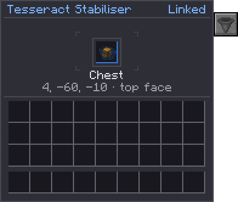

---
navigation:
  title: Tesseract Stabiliser
  parent: machines/index.md
  position: 13
  icon: quantimium:tesseract_stabilizer
---

# Tesseract Stabiliser

<ItemImage id="quantimium:tesseract_stabilizer" scale="2" />

| | |
| --- | --- |
| **Type** | Remote inventory access |
| **Tier** | [Mid](../concepts/tiers.md) |
| **Holds** | One bound [Tesseract](../items/tesseract.md) |
| **Range** | Unlimited, across dimensions |
| **Carries** | Items and fluids |
| **Automation** | Every face but the open one |
| **Power** | None |

The Tesseract Stabiliser puts **a remote inventory right here**. Dock a bound Tesseract in it, and
every face of the Stabilizer behaves like the block the Tesseract is bound to, wherever that block
is. A hopper under the Stabilizer drains a chest across the world; a pipe into its side fills a
tank in the Nether.

It holds nothing itself. Every item and fluid moves straight between the remote block and whatever
is using the Stabilizer. It uses no power and emits no flux.

> **Badges**
>
> Badges like show whether an in-game test backs the rule next to
> them. See Mechanics coverage.

## Tesseracts

A **Tesseract** is bound to one face of one block. Both kinds bind the same way:

- **Sneak + right-click** a block with an inventory or tank. The
  Tesseract remembers the block, its position and dimension, and **the face you clicked**.
- **Right-click the air** to clear it.

The face matters, because it is the side the Tesseract reads from, as a pipe on that face would. A
Tesseract bound to the **top** of a furnace reaches its ingredient slot; one bound to the **side**
reaches the fuel; one bound to the **bottom** reaches the result.

| | <ItemLink id="quantimium:tesseract" /> | <ItemLink id="quantimium:semi_stable_tesseract" /> |
| --- | --- | --- |
| Range | Unlimited, any dimension | 16 blocks (in each axis), same dimension |
| Carries | Items and fluids | Items only |
| Quantum Crafter grid | Remote ingredients | Nearby remote ingredients |
| Containment Hall residue slot | Yes | Yes |
| Tesseract Stabiliser | Yes | **No** |

A link reaches **only the block it was bound to**. If that block
is broken or replaced by a different one, the link goes dead until it is bound again. It also goes
quiet while the target's chunk is unloaded: a Tesseract doesn't load chunks.

## Placing it

The Stabilizer points away from whatever you place it against. On a
floor its open face is up, as it always was; placed on a machine's side it hangs off that side with its
base against the machine and the open face pointing out; placed under a ceiling it hangs upside down.
The open face is where the tesseract floats and the one face with no automation, so every other face,
including the top when it's on a wall, carries items and fluids.

## Docking

Right-click the Stabilizer with a bound Tesseract to dock it. It takes
one, and only the full Tesseract; a Semi-Stable Tesseract won't dock.

- **Sneak + right-click** with an empty hand to take the Tesseract back out.
- Right-click with an empty hand to open its screen: the docked Tesseract, the link's status, and
  the block it reaches, with its position and the face it was bound to.
- Breaking the Stabilizer drops the docked Tesseract.

## Proxying

With a Tesseract docked, each of the Stabilizer's five solid faces
(every face but the open one) offers the **linked block's** items and fluids, as seen from the face the
Tesseract was bound to. Anything that inserts into or extracts from the Stabilizer is working on the
remote block directly:

- a hopper above a chest's Stabilizer fills the chest;
- a hopper under it empties the chest;
- a Modern Industrialization or Mekanism pipe treats it as the remote tank.

Nothing passes through a buffer, so nothing is lost if the link drops mid-transfer.

## Side configuration

Each face can be set to **Off**, **In** (things can go in
only), **Out** (things can come out only) or **Both**, for items and fluids separately. Every face
starts as Both for both. Set it in the [side configuration](../concepts/side-configuration.md) editor (the hopper tab on its screen), or hit a face with a wrench (any
`#c:tools/wrench` item): a click cycles that face's item mode, a sneak-click its fluid mode.

A face can also move things by itself. Once a second, a face
with:

- **auto input** pulls up to one stack of items, and as much fluid as fits, from the block beside
  it into the remote block;
- **auto output** pushes up to one stack, and as much fluid as fits, from the remote block into the
  block beside it.

An auto input face needs a mode that allows input, and an auto output face one that allows output.

## Status

The status shows at the top right of its screen:

| Status | Meaning |
| --- | --- |
| Empty | No Tesseract docked, or an unbound one: *"Insert a bound Tesseract"* |
| Linked | Proxying the bound inventory |
| Unloaded | The bound block's chunk is unloaded, or the block is missing or has been replaced |

The Stabilizer's open face shows a small window into the link.

## Uses

- **Remote storage access.** Bind a Tesseract to your main chest and dock it by your smeltery: pipes
  there now feed straight into the chest.
- **Cross-dimension logistics.** Bind to a tank in the Nether and set a Stabilizer at home to auto
  output into your machines.
- **Feeding the Containment Hall.** A Tesseract can go straight into a
  [Containment Hall's](../multiblocks/containment-hall.md) residue slot; a Stabilizer is the way to
  share one residue chest with pipes as well.
- **Crafter chains.** Tesseracts in a [Quantum Crafter's](quantum-crafter.md) grid read remote
  inventories directly. A Stabilizer is for everything else that needs the same inventory.
