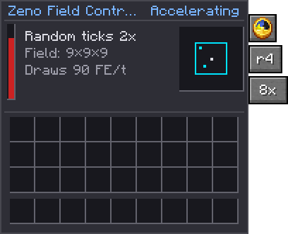

---
navigation:
  title: Zeno Field Controller
  parent: machines/index.md
  position: 14
  icon: quantimium:zeno_field_controller
---

# Zeno Field Controller

<ItemImage id="quantimium:zeno_field_controller" scale="2" />

| | |
| --- | --- |
| **Type** | Random tick control |
| **Tier** | [Mid](../concepts/tiers.md) |
| **Energy buffer** | 500,000 FE |
| **Max input** | 10,000 FE/t |
| **Field** | A cube, radius 1 to 8 (3×3×3 to 17×17×17) |
| **Modes** | Hold, or accelerate 2×, 4×, 8× or 16×, as far as the flux band allows |

*A watched pot never boils.* The quantum Zeno effect says a system watched closely enough never
changes. The Zeno Field Controller watches a cube of the world. In **Hold** mode nothing in it
changes by chance: crops stop growing, leaves stop decaying, ice and snow stop melting, copper stops
weathering, grass and mycelium stop spreading. In **Accelerate** mode it does the opposite, and
those changes come faster.

It only touches **random ticks**, the chance-driven updates vanilla gives blocks now and then.
Machines, redstone, furnaces and other block entities in the field work as normal.

> **Badges**
>
> Badges like show whether an in-game test backs the rule next to them. See
> Mechanics coverage.

## Settings

The three tabs down the right of its screen:

| Tab | Does |
| --- | --- |
| Packed ice / clock | Switches between **Hold** (packed ice) and **Accelerate** (clock) |
| **r4** | The radius: the field is every block within this many blocks of the controller, in each axis. Click to grow it; past 8 it starts again at 1. |
| **8x** | Accelerate only: how many times the usual random tick rate. Cycles 2×, 4×, 8×, 16×. |

The diagram on the right shows the field to scale: frosted while holding, ticking while
accelerating.

## Hold

While powered, nothing inside the cube is picked for a random tick. It
covers blocks and fluids, and takes effect the tick the controller powers up; it lifts two ticks after
it loses power, is broken or is switched to Accelerate.

Holding costs **10 FE/t
per block of radius**. It follows the radius, not the volume, so a big field isn't punishing:

| Radius | Field | Cost |
| --- | --- | --- |
| 1 | 3×3×3 | 10 FE/t |
| 4 | 9×9×9 | 40 FE/t |
| 8 | 17×17×17 | 80 FE/t |

**Uses.** Keep a build exactly as it is: leaves on a custom tree that isn't attached to logs, ice
in a sculpture, unwaxed copper at the shade you like, a lawn that shouldn't spread into a path.

## Accelerate

The controller gives extra random ticks to random spots in its cube, at
the rate vanilla would give them, times the factor, less the ticks vanilla already gives. At 4× a field
gets its own random ticks plus three times as many again. Vanilla picks 3 blocks per 16×16×16
section each tick (the `randomTickSpeed` game rule), so an accelerating field adds:

> extra random ticks per tick = randomTickSpeed × (factor − 1) × blocks in the field ÷ 4096

**A hotter field runs faster.** The fastest rate depends on the flux band
where the controller stands: **2×** at Low, **4×** at Medium, **8×** at High, and **16×** at
Critical and Singularity (config `zenoField.maxFactorByBand`). A faster rate chosen runs at the
band's until the field is hot enough. At **Singularity** accelerating costs 75% of its usual FE
(`zenoField.singularityCostPercent`). Holding works in any field.

It costs **45 FE/t
for each step of factor above 1, per half block of radius**:

> FE/t = 45 × (factor − 1) × radius ÷ 2

Like holding, it follows the radius rather than the volume: the widest field does a lot more work
for the same price per step.

| Radius | Factor | Extra ticks a second | Cost |
| --- | --- | --- | --- |
| 2 (5×5×5) | 4× | 5.5 | 135 FE/t |
| 4 (9×9×9) | 8× | 75 | 630 FE/t |
| 8 (17×17×17) | 16× | 1,080 | 2,700 FE/t |

With random ticks switched off (`randomTickSpeed` 0) it adds nothing and costs nothing.

**Uses.** Crops, sugar cane, cactus, bamboo and saplings grow faster; amethyst buds form faster;
kelp and vines climb faster.

**Upkeep isn't sped up.** Some blocks' random tick is upkeep rather than growth, and costly on a
server with a field running hard:

- Blocks in `#quantimium:zeno_ignored` get no extra ticks. By default that
  is farmland, whose tick only checks for water nine blocks across: the crops on it grow just as fast.
- Blocks in `#quantimium:zeno_slowed` get a share of them,
  `slowedTickChance` in the config (1 in 8 by default). By default that is grass and mycelium, so
  they still spread faster, just not 16 times faster.

Both keep their normal ticks. Packs can add to either tag.

**A cap, if you want one.** `maxExtraTicksPerTick` in the `zenoField` config
section limits the extra random ticks one controller adds each tick, counting every copy when it runs
in a Simulator. It is 256 by default: about five of the biggest, fastest fields (radius 8 at 16×
adds about 54 a tick), so a Simulator can still multiply one, but nested Simulators can't multiply
it 64 times over. Set it to 0 for no cap. The FE cost doesn't change with it.

**Hold wins.** A block inside both a holding and an accelerating
field is held: the accelerating controller skips it.

## In a Quantum Simulator

A controller taken into a [Quantum Simulator](quantum-simulator.md)
keeps working, centred where it stood (now the Simulator's field block). Accelerating, every copy in
the Simulator's batch adds its own extra ticks: an 8× controller in a Simulator at 4× batch gives the
field four times the extra ticks. The Simulator pays for every copy, plus its 20% overhead: 4 × 630
× 1.2 = 3,024 FE/t for the radius 4, 8× example above.

**Nesting multiplies.** A Simulator holding a Simulator holding a
controller runs the product of the two batches: 8× within 8× is 64 copies, though the extra ticks
still stop at the cap above. Each Simulator adds its
own 20% overhead, and both keep running for as long as they're powered.

Holding doesn't multiply: a field is either still or it isn't.

## Flux

Like every Quantimium machine, it emits **1 flux per 1,000 FE** it spends. A large field at 16× is a
steady source of flux; plan containment round it. Inside a Simulator the Simulator emits the flux
instead.

## Recipe

Four polished deepslate, two packed ice and two clocks round a Quantimium Trace.
