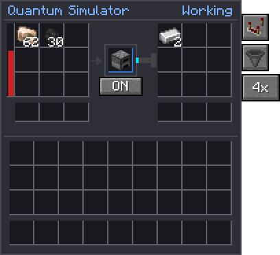

# Writing the wiki

Most of this wiki is generated; the rest is written by hand in `wiki/pages/`. Both are built by one
command, so a change to the mod shows up here the next time it is built.

## Building it

```bash
python3 -m venv .venv-wiki && .venv-wiki/bin/pip install mkdocs-material pillow   # once
.venv-wiki/bin/python tools/wiki/build.py            # build into wiki/build/site/
.venv-wiki/bin/python tools/wiki/build.py --serve    # live preview at http://127.0.0.1:8000
```

The build fails on an unknown constant, a missing scene, or a broken link, so it doubles as a check.

## The in-game guide

The same pages are the in-game guide, for [GuideME](../concepts/partner-mods.md#guideme). After
changing the wiki, rebuild it and commit what it writes:

```sh
.venv-wiki/bin/python tools/wiki/guideme.py
```

It fills in constants, drops the mechanic badges, turns item links into GuideME's, and makes the
admonitions quotes and the tabs headings. Block and item pages get GuideME's own recipe view. The
reference section and this page are left out. The dev client asks GuideME to check every page once
a world loads: look for `Compiling` and any errors after it in `run/logs/latest.log`.

## What is generated

- **A page for every block and item**, from the language file. Its icon is rendered from the real
  model; its description and status come from `CONTENT.md`; its recipes, and the recipes that use it,
  come from the recipe files.
- **The [Constants](../reference/constants.md) page**: every numeric constant in the Java source.
- **The [Mechanics coverage](../reference/coverage.md) page**: see below.

To add written content to a generated page, create `wiki/pages/blocks/<id>.md` or
`wiki/pages/items/<id>.md`; it is merged in under the infobox.

## Markup

| Write | Get |
| --- | --- |
| `{{c:Veiled.AREA}}` | A constant from the Java source: `Class.NAME` |
| `{{c:Veiled.PIN_TICKS|s}}` | Ticks as seconds; `|min` for minutes, `|x20` for per-second |
| `[[item:rift_residue]]`, `[[block:rift_anchor]]` | A link with the icon |
| `[[render:foundry]]` | An isometric render (the scenes in `tools/block_preview.py`) |
| `[[structure:reactor]]` | A multiblock in 3D that players can turn, in the in-game guide only. The structures in `wiki/structures` are built by `GuideStructures` and saved with `./gradlew runGameTestServer -PexportStructures`; rerun it when a multiblock changes. |
| `[[recipes:quantimium:quantum_foundry]]` | Every recipe of a type, drawn |
| `[[mechanic:hall.residue.burn]]` | Declares a mechanic, with its test status |

**Quote numbers with `{{c:…}}` whenever the code has them as a constant**, so a balance change
cannot leave the wiki behind. Where a number lives in a method or a config file, write it out,
and mark the rule as a mechanic so a test pins it down.

## GUI screenshots

The machine screens on these pages are real captures, kept in `wiki/pages/assets/gui`. To take
them again after a GUI change:

```bash
tools/wiki_shots.sh
```

It starts the game (it needs a display), creates a fresh creative flat world, builds every machine
with believable contents, opens each screen and saves the panel, cropped, at GUI scale 2. It then
quits by itself, in about a minute. The setup lives in `client/dev/WikiScreenshots.java`, and it
does nothing unless the game is started with `-Dquantimium.wikiShots`.

Embed a capture with the `qgui` class so it stays crisp:

```markdown
{ .qgui }
```

The captures double as a layout check: look them over after touching a screen.

## Mechanics and tests

Every rule a page states should carry a mechanic id: `[[mechanic:area.rule]]`, just before the rule.
A GameTest covers a mechanic by naming it in a comment:

```java
// covers: hall.residue.burn, hall.starve
@GameTest(template = "hall_one_arm")
public static void hallBurnsResidue(GameTestHelper helper) { ... }
```

The [coverage report](../reference/coverage.md) lists every documented mechanic and what tests it,
so the untested rows are the test backlog. When you add a feature: write its page with mechanic ids,
then write the tests that turn its badges green.

## Running the tests

```bash
./gradlew runGameTestServer
```

A headless server builds each test on a stone floor, runs them all (it ticks as fast as it can, so a
thirty-second test takes a moment) and fails the build if any fail. In a normal dev world, `/test
runall` runs them where you can watch.

Tests live in `src/main/java/com/kadikular/quantimium/gametest/`; `TestSupport` builds halls, sets a
chunk's field and adds stand-in players. Three rules keep them honest:

- **Tests share one world.** Anything that reaches past its own floor (flux spreading across chunks,
  a hall's 32-block reach, the one-Veiled-per-area rule, the dimension's rift list) runs in its
  own `batch`, and batches run one after another.
- **Clean up before succeeding.** Break the hall, remove the rift, discard the Veiled, remove the
  player; otherwise they carry on into later tests.
- **Test the rule the wiki states, not the code.** Work the expected value out the way the page
  describes it. That is how the drain test caught the wiki being vague about bands.

### Tick timing

`TickTimingTests` (and `MiTickTimingTests` with Modern Industrialization) time the machines that do
the most per tick, idle and working, alone and inside simulators. A mixin wraps the level's call into
each ticking block entity while a test is watching it, so the number is what a server profiler would
show. Each scenario gets its own batch, warms up, records every tick and reports the median to the
[tick timing](../reference/tick-timing.md) page (via `wiki/data/tick-timing.json`, so commit that
file). Each has a budget with plenty of headroom: it fails on a real regression, not a slower machine.

To see *why* something is slow, record a profile:

```bash
./gradlew runGameTestServer -Pjfr
```

That samples every millisecond into `build/gametest.jfr` and runs each timing scenario for 20,000
ticks so it shows up; `jfr print --events jdk.ExecutionSample` reads it.

### Partner mod tests

Tests against other mods live in `gametest/compat/`, one class per mod (`MiCompatTests`,
`Ae2CompatTests`, `HnnCompatTests`). `CompatGameTests` registers each class only when its mod is loaded, so with the
mod missing its tests don't run at all, rather than passing without testing anything. They reach
the mod's blocks, items and fluids by id, so there is no compile-time dependency.

The test server runs in `run-gametest/`, with `run/mods` copied in first, bar client-only map mods
(JourneyMap breaks a dedicated server when the tests' fake players join). Its log is
`run-gametest/logs/latest.log`. `./gradlew runGameTestServer -PbareMods` runs it with no other mods
at all, to prove none is needed; the partner tests then don't register. After updating a partner
mod in `run/mods`, run the tests:
anything the update broke fails straight away. See [Partner mods](../concepts/partner-mods.md) for
what they cover.
