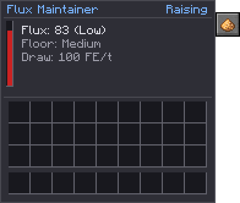
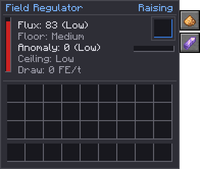

# Flux Maintainer, Anomaly Siphon and Field Regulator

Blocks that hold a chunk's [field](../concepts/flux-and-anomaly.md) where you set it, instead of
leaving it to whatever your machines happen to do. The **Flux Maintainer** keeps flux up to a floor you
choose, the **Anomaly Siphon** keeps anomaly down under a ceiling, and the **Field Regulator** does both.
They are the step up from the [[block:quantum_exciter]] (which only ever holds Medium) and the
[[block:basic_anomaly_siphon]] (which only ever holds the top of Low).

Two early members of the family work the same way: the [[block:basic_anomaly_siphon]], a fixed, small
Siphon and the first source of fragments, and the [[block:flux_suppressor]], which holds **flux** under
a ceiling for firebreaks and starving rifts.

| Tier | Flux up | Flux down | Anomaly down (fragments) |
| --- | --- | --- | --- |
| Early | [[block:quantum_exciter]] | [[block:flux_suppressor]] | [[block:basic_anomaly_siphon]] |
| Mid | Flux Maintainer | – | Anomaly Siphon |
| Late | Field Regulator (both) | – | [Containment Hall](../multiblocks/containment-hall.md) |

{ .qgui }

| | Flux Maintainer | Anomaly Siphon | Field Regulator |
| --- | --- | --- | --- |
| Tier | Mid | Mid | Late mid |
| Holds flux at least | Medium, High or Critical | – | Medium, High or Critical |
| Keeps anomaly at most | – | Low, Medium, High or Clear | Low, Medium, High or Clear |
| Draw while raising | {{c:FieldControlBlockEntity.RAISE_FE_PER_TICK}} FE/t | – | 80% of that |
| Draw while pulling | – | {{c:FieldControlBlockEntity.PULL_FE_PER_TICK}} FE/t | 80% of that |
| Anomaly Fragments | – | Yes | Yes |

All three have a {{c:FieldControlBlockEntity.ENERGY_CAPACITY}} FE buffer taking up to
{{c:FieldControlBlockEntity.ENERGY_MAX_RECEIVE}} FE/t, read their own chunk twice a second, and say what
they are doing: **Holding**, **Raising**, **Pulling**, both, or **No power**. They work in proportion to
how far off the field is, so they settle rather than switching on and off.

## Holding flux up

[[mechanic:field.maintain]] Set the floor with the **F** tab. It raises flux towards
{{c:FieldControlBlockEntity.RAISE_TARGET}} times the floor band's start, flat out at no flux and easing
off as it gets there. It counts flux still easing into its chunk, so it doesn't overshoot. It settles a
little under its target, inside the band: for Medium, round 300 of a 400 target. It shows **Raising**
while the chunk is below the floor and **Holding** once it's in the band, even though it keeps topping
it up.

It raises with **pure flux**, at the Exciter's {{c:QuantumExciterBlockEntity.EFFICIENCY}}× yield: no anomaly
comes with it. Uncontained flux still couples into anomaly over time, as it always does, which is why the
Siphon exists.

**What it can hold.** Flat out, a Maintainer puts about as much flux into its chunk as 100,000 FE/t of
ordinary work, so one holds High comfortably and Critical at the low end of the band.

## Holding anomaly down

[[mechanic:field.siphon]] Set the ceiling with the **A** tab: **Low**, **Medium**, **High** or **Clear**. It
holds anomaly in **every chunk of the 3×3 round it** just under the top of that band, clear of the
edge: 80 for Low, 800 for Medium, 8,000 for High. Clear holds it at nothing, as containment would,
bar a trace drifting in each second from chunks outside its reach. It pulls **anomaly only**, like a
[hall](../multiblocks/containment-hall.md), so the flux you built up stays: up to
{{c:FieldControlBlockEntity.PULL_PER_SECOND}} a second from the 3×3 round it, a fifth of that from
its own chunk, twelve times a Basic Siphon's pull for four times its power.

[[mechanic:field.siphon_mark]] **It lands on its mark and stays.** Each second it asks the field to take
only what each chunk has over its mark, and the field takes it in its own once-a-second step, after
the climb it answers. So a chunk comes down to the mark and sits there, with no swing past it and no
saw-tooth within the second. It draws power in proportion to what it takes.

[[mechanic:field.siphon_steady]] Beside a 10,000 FE/t workshop, a Low Siphon holds every chunk round it
at 80 and never switches off.

What it pulls it turns into [[item:anomaly_fragment]]s, one per {{c:FieldControlBlockEntity.ANOMALY_PER_FRAGMENT}},
into a slot pipes and hoppers can take from. A full slot voids the surplus.

## Both at once

[[mechanic:field.regulator]] The Field Regulator is a Maintainer and a Siphon in one block, with both tabs,
at **80%** of their FE. It is the natural partner of a high-flux base: flux held where your crafts need it,
anomaly kept from building up behind it.

[[mechanic:field.setpoints]] Each tab steps through its bands and round again; each block has only the
tabs for what it does.

[[mechanic:field.power]] Short of power for what it has to do, a block says **No power** and does nothing.

{ .qgui }

## In a Quantum Simulator

[[mechanic:field.simulator]] Taken into a [Quantum Simulator](quantum-simulator.md), each block holds the
Simulator's chunk to the same setpoints, and every copy in the batch works: at 8× a Maintainer raises
flux eight times as fast and a Siphon pulls eight times as much. The Simulator pays for every copy, plus
its 20% overhead, and only while the block is raising or pulling; holding costs nothing.

- The Simulator emits its own flux for what it is charged, on top of the Maintainer's pure flux, and that
  brings a little anomaly with it. A simulated Siphon keeps the anomaly under its ceiling, but may rest a
  little above where it stops pulling.
- Fragments come out into the Simulator's outputs, one for every
  {{c:FieldControlBlockEntity.ANOMALY_PER_FRAGMENT}} pulled, as in the world. They arrive a batch at a time:
  each copy makes one when its share of the pull comes to that much.

## Recipes

- **Flux Maintainer:** a [[block:quantum_exciter]] in four glowstone, on polished deepslate with a block of
  redstone.
- **Anomaly Siphon:** a [[block:basic_anomaly_siphon]] in four [[item:anomaly_fragment]]s, on polished
  deepslate with a block of redstone.
- **Field Regulator:** a Flux Maintainer and an Anomaly Siphon either side of a nether star, with two
  [[item:tesseract]]s and four Anomaly Fragments.
