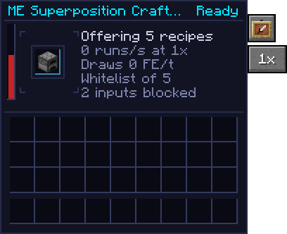
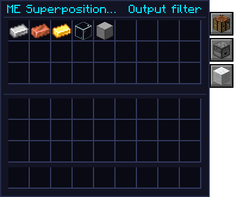
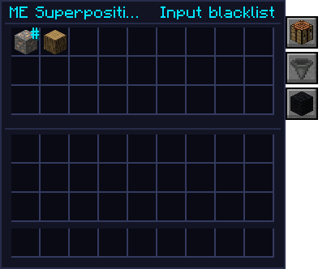

# ME Superposition Crafter

<table>
<tr><th>Type</th><td>ME autocrafting provider</td></tr>
<tr><th>Tier</th><td><a href="../concepts/tiers.html">High</a></td></tr>
<tr><th>Requires</th><td>Applied Energistics 2</td></tr>
<tr><th>Energy buffer</th><td>{{c:SuperpositionCrafterBlockEntity.ENERGY_CAPACITY}} FE</td></tr>
<tr><th>Max input</th><td>{{c:SuperpositionCrafterBlockEntity.MAX_RECEIVE}} FE/t</td></tr>
<tr><th>Batch</th><td>1× to 64× recipe runs per pattern</td></tr>
<tr><th>Throughput</th><td>Up to {{c:SuperpositionCrafterBlockEntity.MAX_RUNS_PER_TICK}} recipe runs a tick</td></tr>
<tr><th>ME channel</th><td>1</td></tr>
</table>

The high-tier sibling of the [Quantum Crafter](quantum-crafter.md), for Applied Energistics 2
networks. Put a machine in its catalyst slot and connect it to an ME network: **every recipe that
machine can run** is offered to the network as a pattern. Nobody encodes anything. Ask a terminal
for iron ingots and the network plans the job, hands the Superposition Crafter the raw iron, and gets
the ingots back a tick later.

It has no grid and no preview, so off a network it does nothing. It exists only when AE2 is installed.

[[mechanic:ae2.superposition.link]] **Its cell shows its link.** Like the
[Quantum Crafter](quantum-crafter.md), the open frame holds a room of void with the catalyst turning in
a folding tesseract cell. Offline, the frame's traces are dark and the cell is a bare red wireframe. On
a powered ME network with a free channel the traces light and the cell turns azure; while it crafts,
the cell burns brighter and folds faster.

[[mechanic:ae2.superposition.ports]] **Port plates.** A side that meets an ME cable or device, a power
source or an item pipe grows a small socket plate, so the connection has something to meet instead of
the open frame.

[[render:superposition]]

{ .qgui }

!!! info "Badges"
    Badges like [[mechanic:ae2.superposition.patterns]] show whether an in-game test backs the rule
    next to them. See [Mechanics coverage](../reference/coverage.md).

## Superposed patterns

[[mechanic:ae2.superposition.patterns]] The catalyst decides everything. A furnace offers every
smelting recipe; a Modern Industrialization macerator every macerator recipe; a Mekanism enrichment
chamber every enriching recipe. The patterns are made in code: each lists the recipe's ingredients,
with every item a tag allows as an alternative ("any raw iron"), and its guaranteed outputs.

Left out, as the Quantum Crafter leaves them out:

- recipes with fluid inputs;
- chance outputs (only the guaranteed ones are offered);
- recipes with an ingredient that is never used up, like an Inscriber's press.

**Which machines.** The catalyst must be in the `#quantimium:superposition_crafter_catalysts` tag:
the furnace, blast furnace, smoker and campfires, plus every catalyst in the Quantum Crafter's
advanced, industrial and singularity tiers. Crafting tables and stonecutters are left to AE2's own
Molecular Assembler. Packs can add or remove machines through the tag.

[[mechanic:bands.me_crafter]] **Bigger machines need a hotter field**, as in the
[Quantum Crafter](quantum-crafter.md#the-catalyst): an advanced catalyst needs Medium flux where the
crafter stands, an industrial one High, and so on. Below its band it offers the network nothing, so
its crafts drop out of the terminals, and its status says **Needs flux**. It pays the Quantum
Crafter's instant-craft tax for the band, so it crafts cheaper in a hot field too.

## When the network asks

[[mechanic:ae2.superposition.push]] For each run the network hands over the ingredients, and the
Superposition Crafter:

1. pays for it from its own FE: exactly what the Quantum Crafter would charge (see
   [Energy cost](quantum-crafter.md#energy-cost)), times the instant-craft multiplier, plus the
   chunk's anomaly surcharge. A smelt is 4,000 FE;
2. puts the result into the network, where AE2 passes it to the job that asked;
3. [[mechanic:ae2.superposition.flux]] emits flux like any craft: 3 flux per 1,000 FE, each second,
   into the 3×3 of chunks round it, a fifth to its own. A 64× smelt run (256,000 FE) adds about 154
   flux to its own chunk, easing in over the next few seconds.

The energy bar's tooltip shows the anomaly surcharge in force and any passive drain.

Results go into the network on the crafter's next tick, once AE2 is waiting for them. If the network
has no room, the crafter keeps them, shows **Output blocked** and takes no more work until it can
hand them over.

## Batch

[[mechanic:ae2.superposition.batch]] AE2 hands a crafting provider one pattern run at a time, as fast
as the crafting CPU's co-processors allow. The **batch tab** (1× to 64×) sets how many recipe runs one
pattern run is, so a bigger batch crafts proportionally faster with the same CPU. At 8× the smelting
pattern takes 8 raw iron, gives 8 ingots and costs 8 smelts: 32,000 FE.

A request that isn't a whole number of batches still makes whole batches, and the extra goes to
storage: asking for 4 ingots at 8× makes 8. Changing the batch changes the patterns, so AE2 replans.
The crafter takes at most {{c:SuperpositionCrafterBlockEntity.MAX_RUNS_PER_TICK}} recipe runs a tick.

[[mechanic:ae2.superposition.autocrafting]] It works with everything AE2 does with patterns:
terminals show the outputs as craftable, multi-step jobs use it for the steps it can do, and other
providers can offer the same recipes alongside it.

**Mind the flux.** Autocrafting at scale is the fastest way to heat a chunk. Anomaly raises every
craft's cost by up to +200% and, left alone, brings rifts and the
[Veiled](../mechanics/veiled.md). Big AE2 bases will want [containment](../multiblocks/containment-hall.md).

## Filters

The **filter tab** (item frame) swaps the readout for the filters. There are two lists of 27 entries;
the **list tab** switches between them (a dropper for outputs, a hopper for inputs), and the title strip
says which one you're editing.

**Setting entries.** Click a slot with an item to list it, or drag one in from JEI, as you would onto a
storage bus. Click with an empty hand to clear it. The slots only hold copies.

[[mechanic:ae2.superposition.tag_entries]] **Tags.** Shift-click an entry to make it stand for one of
its item's tags instead: each shift-click steps to the next tag, convention (`c:`) tags first and the
broadest first, and then back to the plain item. Iron ore's first tag is `#c:ores`, which is every ore.
A tag entry has a small **#** in its corner, and its tooltip names the tag.

### Output filter

[[mechanic:ae2.superposition.filter]] Decides which recipes are offered, by their output. The
**whitelist / blacklist tab** (white or black wool, shown on this list only) chooses what the list means:

| Mode | Offers |
| --- | --- |
| Whitelist (white) | Only recipes whose output is listed |
| Blacklist (black) | Every recipe except those whose output is listed |

An empty output filter offers everything, whatever the mode.

{ .qgui }

### Input filter

Which items the crafter may use up. It has its own **whitelist / blacklist tab**, and starts as a
blacklist. An empty input filter changes nothing.

- [[mechanic:ae2.superposition.input_blacklist]] **Blacklist:** each listed item is taken out of every
  recipe's accepted ingredients; a recipe goes only when an ingredient has nothing left it could take.
  Blacklisting oak logs stops charcoal being made from oak, but charcoal is still offered from every
  other log.
- [[mechanic:ae2.superposition.input_whitelist]] **Whitelist:** only listed items may be used. With raw
  iron alone on the list, a furnace crafter offers just raw iron → iron ingot.

**When two routes make the same thing.** AE2 decides between patterns that make the same item, so a
furnace crafter might smelt ore straight to ingots when you'd rather it went through a macerator first
(ore → raw iron → ingots, which yields more). Blacklist the ore on the furnace crafter, and smelting ore
is no longer a route AE2 can take. With `#c:ores` as a tag entry, one entry covers every ore.

{ .qgui }

[[mechanic:ae2.superposition.filter_saved]] Both lists keep every entry in its own slot through saves.

## Status

| Status | Meaning |
| --- | --- |
| No catalyst | Nothing in the catalyst slot |
| Offline | Not on a powered ME network with a free channel |
| Ready | Offering its patterns, nothing asked for right now |
| Working | Crafting for the network |
| No power | The last run asked for couldn't be paid for |
| Output blocked | The network has no room for a result |

## Recipe

A [[block:quantum_crafter]] with two AE2 Pattern Providers, two [[item:tesseract]]s and four
[[item:anomalite_shard]]s round it.
