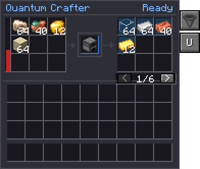
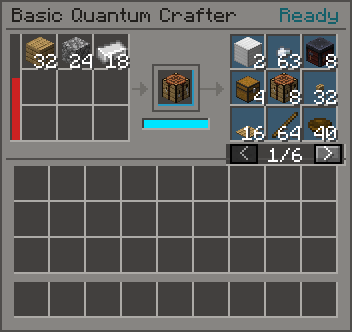

# Quantum Crafter

<div class="qinfo">

<table>
<tr><th>Type</th><td>Instant crafting machine</td></tr>
<tr><th>Tier</th><td><a href="../concepts/tiers.html">Mid</a> (the Basic Quantum Crafter is Low)</td></tr>
<tr><th>Energy buffer</th><td>{{c:QuantumCrafterBlockEntity.ENERGY_CAPACITY}} FE</td></tr>
<tr><th>Max input</th><td>{{c:QuantumCrafterBlockEntity.ENERGY_MAX_RECEIVE}} FE/t</td></tr>
<tr><th>Slots</th><td>{{c:QuantumCrafterBlockEntity.INPUT_SLOTS}} input, {{c:CrafterPreview.MAX_OUTPUTS}} output, 1 catalyst</td></tr>
<tr><th>Automation</th><td>Items, all six faces</td></tr>
<tr><th>Emits</th><td>1 flux per {{c:QuantumFlux.FE_PER_FLUX}} FE spent</td></tr>
</table>
</div>

The Quantum Crafter does what another machine does, **instantly**, and bills you for skipping the
wait. Put a machine in the catalyst slot (a furnace, a crafting table, a Modern Industrialization
macerator) and ingredients in the grid. Every craft that machine could make from them appears in
the output grid as a faint **preview**. Taking one makes it real.

It never runs on its own schedule. Nothing is crafted until something takes an output: you, a
hopper, a pipe, or its own auto-output.

[[render:crafters]]

!!! info "Badges"
    Badges like [[mechanic:crafter.preview]] show whether an in-game test backs the rule next to
    them. See [Mechanics coverage](../reference/coverage.md).

## At a glance

| | Basic Quantum Crafter | Quantum Crafter |
| --- | --- | --- |
| Energy buffer | {{c:QuantumCrafterBlockEntity.BASIC_ENERGY_CAPACITY}} FE | {{c:QuantumCrafterBlockEntity.ENERGY_CAPACITY}} FE |
| Max input | {{c:QuantumCrafterBlockEntity.BASIC_ENERGY_MAX_RECEIVE}} FE/t | {{c:QuantumCrafterBlockEntity.ENERGY_MAX_RECEIVE}} FE/t |
| Catalysts | Vanilla workstations only | Anything on the whitelist |
| Runs | 32 at a time, then it recovers | Unlimited |
| Automation | Every face, no configuration | Per-face side configuration, auto input and output |
| Tesseracts in the grid | Yes | Yes |

A Basic crafter's buffer takes about 8 minutes to fill from a 100 FE/t generator.

## The catalyst

[[mechanic:crafter.catalyst]] The catalyst slot decides **which recipes** the crafter can make. It
takes one machine and never uses it up.

| Catalyst | Recipes |
| --- | --- |
| Crafting Table | Crafting (shaped and shapeless) |
| Furnace | Smelting |
| Blast Furnace | Blasting |
| Smoker | Smoking |
| Stonecutter | Stonecutting |
| Campfire, Soul Campfire | Campfire cooking |
| Modern Industrialization machines | That machine's recipe type (an electric macerator makes macerator recipes; MI furnaces also do vanilla smelting) |
| Mekanism machines and factories | Enriching, crushing, combining, smelting |
| Applied Energistics 2 Charger, Inscriber | Charger and inscriber recipes |

Machines outside that list are matched by name: a catalyst whose id contains a recipe type's name
drives that type, with prefixes like `electric_`, `steel_` or `lv_` ignored.

[[mechanic:crafter.catalyst_gate]] A catalyst must be on the `#quantimium:quantum_crafter_whitelist`
tag and not on `#quantimium:quantum_crafter_blacklist`; the blacklist always wins. Anything else
shows **Not allowed** and the preview stays empty. Modpacks add machines by tagging them.
The whitelist is built from four tier tags:

=== "Basic"

    `quantum_crafter_catalysts/basic`: Crafting Table, Furnace, Blast Furnace, Smoker, Stonecutter,
    Campfire, Soul Campfire. These are also the only catalysts the **Basic Quantum Crafter** takes.

=== "Advanced"

    `quantum_crafter_catalysts/advanced`:

    - **Applied Energistics 2:** Charger, Inscriber
    - **Hostile Neural Networks:** Loot Fabricator (see [Partner mods](../concepts/partner-mods.md#hostile-neural-networks))
    - **Modern Industrialization:** bronze, steel and electric compressors, cutting machines,
      furnaces, macerators and mixers; steel and electric packers, unpackers and wiremills;
      Assembler, Centrifuge, Chemical Reactor, Distillery, Electrolyzer, Polarizer
    - **Mekanism:** Enrichment Chamber, Crusher, Energized Smelter, Combiner, and the enriching,
      crushing, smelting and combining factories of every tier

=== "Industrial"

    `quantum_crafter_catalysts/industrial`: Modern Industrialization's bronze and steel boilers, Coke
    Oven, Steam and Electric Blast Furnaces, Implosion Compressor, Vacuum Freezer, Distillation Tower,
    Heat Exchanger, Oil Drilling Rig and Nuclear Reactor.

=== "Singularity"

    `quantum_crafter_catalysts/singularity`: Modern Industrialization's Fusion Reactor.

=== "Blacklist"

    `quantum_crafter_blacklist`: Modern Industrialization's Forge Hammer.

[[mechanic:bands.crafter]] **Each tier needs a flux band** where the crafter stands: the basic
catalysts work anywhere, advanced ones need **Medium**, industrial ones **High**, a multiblock's
controller without its structure **Critical** (until folding comes), and the Fusion Reactor
**Singularity** (config `crafter.catalystBands`). Below it the preview stays empty and the status
says **Needs flux**, with the band needed and where the field is heading.

## The preview

{ .qgui }

[[mechanic:crafter.preview]] Every craft the catalyst can make from the grid's contents is shown in
the output grid as a faint ghost stack, sized to the **largest batch** it could make right now. The
panel reads *"Wavefunction preview — take to collapse"*.

- The grid holds up to {{c:CrafterPreview.MAX_OUTPUTS}} stacks of ghosts. A craft with several
  outputs is shown whole or not at all.
- Block and nugget results come first, then the crafts that use up the most.
- Ingredients are **pooled**. Nine iron ingots in one slot fill all nine positions of an iron block
  recipe; positions in the grid don't matter.
- A craft is shown only if everything it needs is there, **energy included**. When energy is what
  limits a batch, the tooltip says *"Batch limited by stored energy, not ingredients"*.
- If any grid slot holds a blacklisted item, the whole preview stays empty.

## Taking an output: collapse

[[mechanic:crafter.collapse]] Taking a ghost **commits** that craft. The ingredients and energy are
taken, the ghost becomes the real items, and the preview is worked out again from what is left.

- Taking it by hand commits the batch shown.
- A hopper or pipe pulling from the output grid commits **only as many runs as it takes**. A
  hopper pulling one item at a time crafts one item at a time.
- Anything made beyond what was taken is kept as **real items** in the output grid: the second
  product of a two-output craft, or the rest of a run when a hopper takes less than one run makes.
  If the grid has no room for it, the take is refused.

[[mechanic:crafter.preferred]] The last recipe you took becomes the **preferred** recipe and is listed
first. The **recipe lock** shows only that recipe whenever it can be made, which stops a shared grid,
or auto output, from making something else. When it can't be made, the full preview comes back.

## Batch size

[[mechanic:crafter.batch]] One take makes as many runs as the **smallest** of three limits allows:

| Limit | Runs allowed |
| --- | --- |
| Ingredients | As many full sets as the grid (and any linked inventories) holds |
| Energy | Stored FE ÷ FE per run |
| One stack of output | Output's max stack size ÷ output per run |

**Example.** A furnace catalyst, 64 raw iron in the grid, 100,000 FE stored. Ingredients allow 64
runs and a stack of ingots allows 64, but at 4,000 FE a smelt the energy allows only 25. The ghost
shows **25 iron ingots**.

**Unrealised Matter** goes through a catalyst unobserved: it comes out as Matter that remembers the
step (see [[item:unrealised_matter]]).

## Energy cost

[[mechanic:crafter.cost]] Every craft is billed at what the real process would have cost, times the
**instant-craft multiplier** (config `crafter.instantCraftMultiplier`, default **2**, range 1–100).
The multiplier is the price of skipping the wait.

**A hotter field pays less of it.** The Quantum Crafter charges the full multiplier at Low and
Medium, 80% of it at High, 65% at Critical and 55% at Singularity: at the default, **2.0×, 2.0×,
1.6×, 1.3× and 1.1×** (config `crafter.taxPercentByBand`).

| Recipe | Base cost | At the default ×2 |
| --- | --- | --- |
| Crafting table | 100 FE | 200 FE |
| Stonecutting | 100 FE | 200 FE |
| Smelting (200-tick cook) | {{c:CraftEnergy.FE_PER_BURN_TICK}} FE per tick of cook time: 2,000 FE | 4,000 FE |
| Blasting, smoking (100 ticks) | 1,000 FE | 2,000 FE |
| Campfire (600 ticks) | 6,000 FE | 12,000 FE |
| Modern Industrialization | Total EU × MI's `forgeEnergyPerEu` (default {{c:CraftEnergy.DEFAULT_FE_PER_EU}}) | EU × 20 |
| MI recipe with no EU draw | 10 FE per tick of its duration | 20 FE per tick |
| AE2 Charger, Inscriber | 1,600 FE | 3,200 FE |
| Mekanism enriching, crushing, smelting | 2,000 FE | 4,000 FE |
| Mekanism combining | 2,500 FE | 5,000 FE |
| Anything else | 200 FE | 400 FE |

- **No craft is free.** Every run costs at least {{c:CraftEnergy.MINIMUM_FE}} FE.
- **Modern Industrialization** costs are converted with MI's own config, read live, so the two
  energy economies agree. A recipe drawing 8 EU/t for 200 ticks is 1,600 EU, or 16,000 FE before the
  multiplier and 32,000 FE after it.
- **Anomaly surcharge.** [[mechanic:anomaly.surcharge]] Above Low anomaly, every craft costs more:
  +25% at Medium, +50% at High, +100% at Critical, +200% at Singularity. A 4,000 FE smelt costs
  6,000 FE at High. The GUI's energy bar shows the surcharge in force.
- **Passive drain.** Above Low anomaly the buffer also leaks a flat 16–160 FE/t. See
  [Flux and anomaly](../concepts/flux-and-anomaly.md).

The costs of the AE2 and Mekanism recipes come from data files in `data/quantimium/recipe_adapters`,
which packs can add to (see *Recipe adapters* below).

## Flux

[[mechanic:crafter.flux]] Each committed craft emits **{{c:FieldModel.EMISSION_GAIN}} flux per
{{c:QuantumFlux.FE_PER_FLUX}} FE** it cost, into the 3×3 of chunks round the crafter: a fifth to its
own, a tenth to each of the others. It adds no anomaly of its own; flux drives that. A craft that cost
nothing still emits a flat {{c:QuantumFlux.NONELECTRIC_EMIT}} flux (times the same 3).

**Example.** A stack of 64 raw iron smelted at Low anomaly costs 256,000 FE and emits **768 flux**,
about 154 in the crafter's chunk and 77 in each of the eight round it. Do that every few minutes in one place and the chunk climbs
towards Medium.

## Automation

[[mechanic:crafter.automation]] Items only; the crafter has no fluid ports.

**Quantum Crafter.** The [side configuration](../concepts/side-configuration.md) (the hopper tab) sets each face to
Off, In, Out or Both, and which grid slots and output slots it reaches. Every face starts
as Both. With **auto input**, a face pulls from the block beside it once a second; with **auto
output**, it commits and pushes a craft into it, sized to the room the neighbour has. Auto output
uses the preferred recipe when it is available, otherwise the first one in the preview.

**Basic Quantum Crafter.** Every face is both an input and an output, with no configuration and no
auto push or pull. Hoppers and pipes do the moving.

Automation reaches the grid and the output slots only; the catalyst goes in by hand.

## Tesseracts in the grid

[[mechanic:crafter.tesseract]] A bound [[item:tesseract]] in a grid slot adds **the linked
inventory's contents to the ingredient pool**, wherever it is. A [[item:semi_stable_tesseract]] does
the same for inventories within {{c:EntangledLinks.SEMI_STABLE_RANGE}} blocks. Taking a craft pulls
the ingredients straight out of the linked chest.

Links are polled every half second, and the crafter looks for newly reachable inventories once a
second, so a chest filled from elsewhere updates the preview within a moment.

A Tesseract can be bound to **another crafter**. Its output ghosts then count as ingredients, so one
crafter can plan its craft from another's preview: plank → stick → torch in one take.

[[mechanic:crafter.entangled_loop]] Crafters linked in a ring (A reads B, B reads A, or a longer
chain back to itself, up to {{c:QuantumCrafterBlockEntity.MAX_CHAIN_DEPTH}} links deep) would try to
craft from themselves. Every crafter in the loop stops with **Link loop** until a link is taken out.

## The Basic Quantum Crafter

The low-tier crafter. Same preview and costs, with three limits:

{ .qgui }

- [[mechanic:basic_crafter.catalysts]] **Vanilla workstations only**: the `quantum_crafter_catalysts/basic`
  tag. Anything else shows **Not allowed**.
- **A small buffer**: {{c:QuantumCrafterBlockEntity.BASIC_ENERGY_CAPACITY}} FE, enough for 250
  smelts.
- [[mechanic:basic_crafter.coherence]] **Coherence.** It holds a reserve of **32 runs** (config
  `basicCrafter.coherenceCapacity`). Each run it commits uses one, and a batch is never larger than
  the reserve left. The reserve refills steadily, a full reserve every **5 seconds** (config
  `basicCrafter.coherenceRefillTicks`, 100 ticks). While it is empty the crafter shows
  **Recovering**.

In practice a Basic crafter makes about 6 runs a second, sustained, in bursts of up to 32.

## Status

| Status | Meaning |
| --- | --- |
| Idle | No catalyst or no ingredients |
| Ready | A preview is up; take an output to craft |
| No power | A craft matches but the buffer can't pay for one run |
| No recipe | The catalyst makes nothing from these ingredients |
| Not allowed | Not on the whitelist, or on the blacklist |
| Output blocked | The output side has nowhere to put the craft |
| Link loop | Crafters linked in a ring; see above |
| Recovering | Basic only: coherence is used up |
| Needs flux | The catalyst's tier needs a hotter field here |

See [Partner mods](../concepts/partner-mods.md) for what is tested with Modern Industrialization and
AE2.

## Recipe adapters

Mods whose recipes aren't furnace-like or Modern Industrialization recipes can be supported with a
JSON adapter in `data/<namespace>/recipe_adapters/`. The built-in ones cover the AE2 Charger and
Inscriber, Mekanism's item machines, and the machines listed on [Partner mods](../concepts/partner-mods.md#more-machines).
The EnderIO Alloy Smelter's:

```json
{
  "recipe_types": ["enderio:alloy_smelting"],
  "catalysts": ["enderio:alloy_smelter"],
  "catalyst_also": ["minecraft:smelting"],
  "input_mode": "field",
  "input_fields": ["inputs"],
  "output_mode": "field",
  "output_fields": ["output"],
  "energy": { "flat": 2000, "field": "energy" }
}
```

- `input_fields` and `output_fields` name the recipe's own fields. Inputs can be ingredients, sized
  ingredients, or a mod's own wrapper with a count; outputs can be stacks, stack templates, or a
  mod's own wrapper. Only what a recipe always gives is counted: an output with a `chance` below one,
  or with `percentages` that can miss, is left out, and a recipe that only might give anything isn't
  offered. A field a recipe doesn't have gives nothing, so one adapter can serve several recipe types.
- `catalysts` are the machines that run these recipe types, for machines whose names don't say so.
  `catalyst_also` adds other types they run too. Machines still have to be on a catalyst tag.
- `energy.flat` is the base FE before the instant-craft multiplier. `energy.field` reads the recipe's
  own energy instead, times `energy.scale` (1 if left out), with the flat fee if it can't be read.
- `non_consumed_tags` and `non_consumed_items` list ingredients that stay in the grid, like the
  Inscriber's presses.

## Tips

- **Keep the ingredients linked, not loaded.** A Tesseract to your storage chest turns the crafter
  into a crafting terminal for the whole chest.
- **Lock the recipe** before turning on auto output, or it will make whatever the preview lists
  first.
- **Mind the flux.** Crafting in bulk is the fastest way to raise a chunk's flux, and anomaly
  follows.
