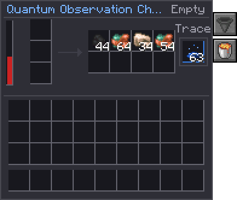

# Quantum Observation Chamber

<table>
<tr><th>Type</th><td>Automated collapse</td></tr>
<tr><th>Tier</th><td><a href="../concepts/tiers.html">Mid</a></td></tr>
<tr><th>Energy buffer</th><td>{{c:QuantumObservationChamberBlockEntity.ENERGY_CAPACITY}} FE</td></tr>
<tr><th>Max input</th><td>{{c:QuantumObservationChamberBlockEntity.ENERGY_MAX_RECEIVE}} FE/t</td></tr>
<tr><th>Speed</th><td>{{c:QuantumObservationChamberBlockEntity.BATCH}} Matter every {{c:QuantumObservationChamberBlockEntity.CYCLE_TICKS|s}}</td></tr>
<tr><th>Cost</th><td>{{c:QuantumObservationChamberBlockEntity.FE_PER_COLLAPSE}} FE a collapse</td></tr>
<tr><th>Automation</th><td>Every face, configurable</td></tr>
</table>

The [[block:observation_chamber]] grown up. Where the stone chamber waits for a redstone pulse, this
one observes on its own: give it [[item:unrealised_matter]] and power, and it collapses it into real
ores as fast as it is fed, handing the results to whatever pipes you give it.

{ .qgui }

## Collapsing

[[mechanic:quantum_chamber.collapse]] Every {{c:QuantumObservationChamberBlockEntity.CYCLE_TICKS|s}}
it collapses up to {{c:QuantumObservationChamberBlockEntity.BATCH}} Matter from its three input slots,
each rolled as the stone chamber rolls it: one of the pack's ores, rarer in a hotter field (see
[[item:unrealised_matter]]), into
its eight result slots. Each collapse costs
**{{c:QuantumObservationChamberBlockEntity.FE_PER_COLLAPSE}} FE**, raised by the chunk's anomaly
surcharge like every machine: 160 FE/t running flat out.

[[mechanic:quantum_chamber.power]] Without the power for a collapse it waits, Matter untouched, and says
**No power**.

[[mechanic:quantum_chamber.flux]] Like any Quantimium machine it emits **1 flux per 1,000 FE** it spends,
once a second.

## Trace

Each collapse has a {{c:ObservationChamberBlockEntity.TRACE_CHANCE}} chance of a [[item:quantimium_trace]]
as well, into its own slot. The **T** tab decides what happens when that slot is full:

- **Void** (lava bucket, the default): the extra Trace is destroyed and collapsing carries on.
- **Keep** (chest): [[mechanic:quantum_chamber.trace_hold]] it stops and says **Full** until there is room,
  so no Trace is ever lost. [[mechanic:chamber.trace_hold]] The stone chamber keeps the same rule.

## Faces

[[mechanic:quantum_chamber.sides]] Open the **S** tab (or use a wrench) to set each face, as on the
[Quantum Crafter](quantum-crafter.md): **In** takes Matter, **Out** hands results and Trace out, **Both**
does either, **Off** does nothing. Every face starts as **Both**. See
[Side configuration](../concepts/side-configuration.md).

[[mechanic:quantum_chamber.auto]] A face can also move things by itself: once a second, an **auto in**
face pulls a stack of Matter from what it touches, and an **auto out** face pushes a stack of results
into it. Chest of Matter on one side, chest for ores on the other, and it runs unattended.

## In a Quantum Simulator

[[mechanic:quantum_chamber.simulator]] Taken into a [Quantum Simulator](quantum-simulator.md), it
collapses a batch at once, like any machine: Matter from the grid, results and Trace to the grid's
outputs, each copy rolled from what the Simulator's chunk would give.

## Status

| Status | Meaning |
| --- | --- |
| Observing | Collapsing |
| Empty | No Matter |
| No power | Not enough FE for a collapse |
| Full | No room for results, or for Trace while it is kept |

## Recipe

The [[block:observation_chamber]] ringed in polished deepslate, with two [[item:quantimium_trace]], an
[[item:anomaly_fragment]] above and a block of redstone below.
