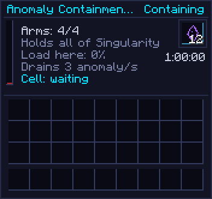

# Anomaly Containment Hall

The hall is the answer to a base too hot to work in. It holds its field up to all of Singularity and
pulls anomaly down, and **only** anomaly, so a deliberately hot field keeps its flux. Its cell can also
hold [the Veiled](../mechanics/veiled.md).

[[render:hall]]

[[structure:hall]]

## Structure

Five blocks tall:

- a 3×3 ring of [[block:quantum_foundry_plinth]] with the [[block:anomaly_containment_hall]]
  controller in the middle;
- three layers of [[block:quantum_attuned_glass]] around a hollow 1×1×3 cell;
- a 3×3 plinth cap;
- one to four attunement arms, the same as the [Foundry](quantum-foundry.md)'s.

The cell must stay clear: a formed hall breaks anything solid inside it each second.

{ .qgui }

## What the arms buy

[[mechanic:hall.arms]] More arms, more field:

| Arms | FE/t | Holds all of | Capacity | Field | Anomaly pulled a second | Capture reach | Capture time |
| --- | --- | --- | --- | --- | --- | --- | --- |
| 1 | 180 | High | 10,000 | 3×3 | 600 | 17 blocks | 7 s |
| 2 | 240 | Critical | 100,000 | 3×3 | 1,200 | 22 blocks | 5.75 s |
| 3 | 300 | Critical | 100,000 | 5×5 | 1,800 | 27 blocks | 4.5 s |
| 4 | 360 | Singularity | 1,000,000 | 5×5 | 2,400 | 32 blocks | 3.25 s |

Its capacity covers its field and fades sharply past it: the 5×5 hall is nearly full to its sides,
two thirds at its corners, and half three chunks out (see
[containment](../concepts/flux-and-anomaly.md#containment)). Its screen shows the
load on its chunk. Draw is {{c:ContainmentHallBlockEntity.FE_PER_TICK_BASE}} +
{{c:ContainmentHallBlockEntity.FE_PER_ARM}} per arm; the pull is
{{c:ContainmentHallBlockEntity.ANOMALY_PULL_PER_ARM}} a second per arm from its whole field, a fifth
of it from the hall's own chunk on a 3×3. Stores {{c:ContainmentHallBlockEntity.ENERGY_CAPACITY}} FE,
taking up to {{c:ContainmentHallBlockEntity.MAX_RECEIVE}} FE/t.

## Holding the Veiled

A formed, powered hall with room takes hold of a worn-down Veiled in its reach (see
[Ending a fight](../mechanics/veiled.md#ending-a-fight)). Once held:

- [[mechanic:hall.residue.burn]] it burns **1 [[item:rift_residue]] every {{c:ContainmentHallBlockEntity.TICKS_PER_RESIDUE|min}}**
  while holding (and only then), whatever the arm count;
- [[mechanic:hall.residue.input]] residue goes in by hand, or by hopper or pipe into **any claimed arm block**. The hall
  keeps up to {{c:ContainmentHallBlockEntity.RESIDUE_CAPACITY}}, which is 80 minutes of holding;
- [[mechanic:hall.residue.tesseract]] a **bound Tesseract** in the residue slot draws residue from the linked
  inventory instead. Point it at a [Rift Anchor](stabilised-rift.md) and the hall runs off a rift;
- [[mechanic:hall.capture_needs_residue]] a hall with no residue cannot take hold of anything.

[[mechanic:hall.cell]] Its screen says what state its **cell** is in: *waiting* (it can take one),
*taken*, *dark* (unformed or unpowered), *armless* or *hungry* (no residue); hover it for more. If a
pinned Veiled gets away beside a hall that couldn't take it, the lancer is told why: *"It slips
away. The hall nearby is hungry: it had no Rift Residue to hold it with."*, or that it was just out
of the hall's reach.

What holding one buys:

- [[mechanic:hall.occupied_pull]] **A stronger field.** An occupied hall drains anomaly
  {{c:ContainmentHallBlockEntity.OCCUPIED_PULL_MULTIPLIER}}× as fast: a four-arm hall pulls 3,600 anomaly
  a second instead of 2,400.
- [[mechanic:veiled.held_dispels]] **Peace in the area.** No rift within {{c:VeiledManager.HELD_PEACE}}
  blocks releases another Veiled, and any free one inside that radius comes apart where it
  stands and is gone. A fight with it ends there.

[[mechanic:hall.starve]] **Running out** starts a {{c:ContainmentHallBlockEntity.STARVE_GRACE_TICKS|s}}
grace: the field stutters, the occupant presses against the glass, and an alarm sounds every
2 seconds. Feed it in time and nothing happens; otherwise it walks out, feeding on the hall.

[[mechanic:hall.power_loss]] **Losing power** does the same, after 10 seconds. **Breaking the controller**
lets it out at once.

## Veil Thread

A [[block:harvest_laser]] can draw [[item:veil_thread]] out of the Veiled a hall holds, firing through
a [[block:rift_lens]] and the middle of any wall of glass. A lens right against the glass seats onto it
with a studded collar. One laser draws from a hall at a time.
