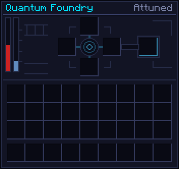

# Quantum Foundry

!!! note "Stub"
    The structure and its recipes. Its field and status rules will be written up next.

The Foundry is Quantimium's first multiblock: a timed crafter that spends FE **and local flux**, and
grows things no table can make, the full Tesseract among them.

[[render:foundry]]

[[structure:foundry]]

## Structure

A 7×7 cross, one layer high plus the tanks:

- a [[block:quantum_foundry_controller]] in the middle of a 3×3 ring of [[block:quantum_foundry_plinth]];
- one to four **attunement arms** out of the ring's sides, each a [[block:quantum_foundry_conduit]],
  then a [[block:quantum_foundry_pillar]] with a [[block:quantum_foundry_attunement_tank]] on top.

Each arm is one recipe socket, so a recipe with more ingredients needs more arms. Power goes in
through any plinth. The arms are shared with the
[Containment Hall](containment-hall.md).

{ .qgui }

## Recipes

[[recipes:quantimium:quantum_foundry]]
