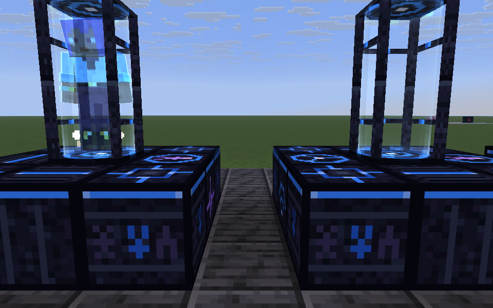
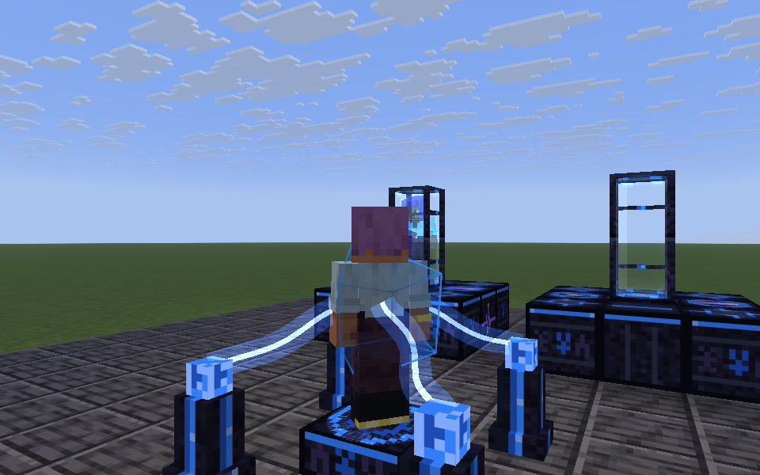
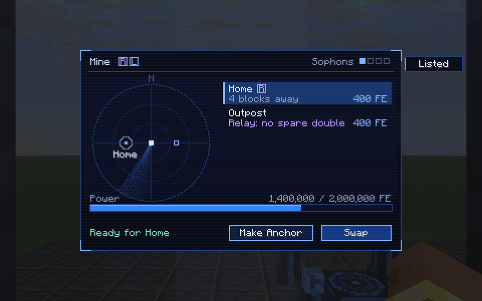
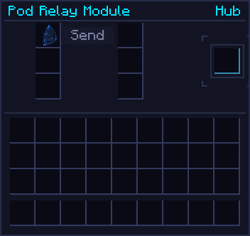
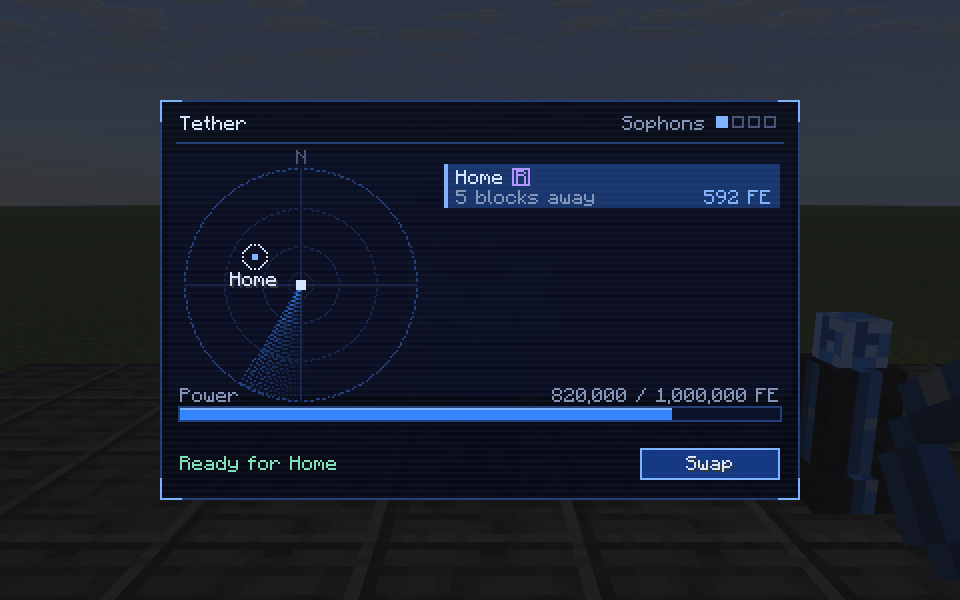
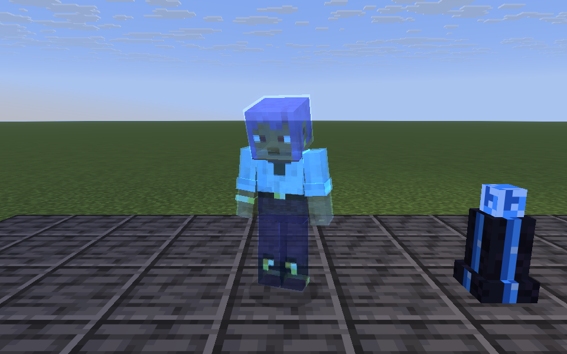

# Superposition Pod

Leave copies of your body waiting in pods across the world, and step into any of them. A Superposition
Pod holds one body: yours while you stand in it, a **double** of you while you are somewhere else. From an
empty pod you can swap into any of your doubles, and the body you stood in stays behind, waiting for the
trip back. With a Rescue module a pod is also your death save.

{ .qgui }

!!! info "Badges"
    Badges like [[mechanic:pod.swap]] show whether an in-game test backs the rule next to them. See
    [Mechanics coverage](../reference/coverage.md).

## The one rule

You are always in exactly one body. Swapping never makes a body, it only moves you between the ones
there are: the pod you step out of keeps the body you left. Your health, hunger, effects, inventory and
XP always go with you; a double is an empty body kept on your pattern, and it holds nothing.

So two pods and one double make a link that lasts for good: swap out to the mine and your old body
waits at home; swap back tonight and the one at the mine waits for tomorrow. Walk home instead, and
there is no body at the mine to swap into until you walk back (or fold the double up and carry it).

## Making a double: the Unfolding Array

{ .qgui }

[[structure:unfolding_array]]

A double is made at the [[block:unfolding_array]]: a low pad with an [[block:array_pylon]] on each
diagonal corner (a 3×3 with the edges left open so you can walk on).

- Put in a **[[item:semi_stable_tesseract]]** to fold you into, **{{c:UnfoldingArrayBlockEntity.FRAGMENTS}}
  [[item:anomaly_fragment]]s** and **{{c:UnfoldingArrayBlockEntity.RESIDUE}} [[item:rift_residue]]**, stand on
  the pad and press **Unfold**.
- [[mechanic:array.unfold]] Over {{c:UnfoldingArrayBlockEntity.UNFOLD_TICKS|s}} the pylons reach into you,
  a proton unfolds round you, and your double peels away beside you, to be folded up into a
  **[[item:sophon]]** bound to you. It draws {{c:UnfoldingArrayBlockEntity.FE_PER_TICK}} FE/t as it goes,
  from a {{c:UnfoldingArrayBlockEntity.ENERGY_CAPACITY}} FE buffer.
- Step off the pad and it waits for you, but loses ground while you are gone.
- [[mechanic:array.cap]] **The soul can only be split so many times.** You can have **4** Sophons at once,
  folded or in pods (`maxDoubles` in the `superposition` config section). The Array refuses a fifth.

## The pod

[[structure:pod]]

The capsule stands on the middle of a 3×3 **cradle**, one block down: [[block:pod_cradle]] at the four
corners and under the capsule, and on each of the four edges either [[block:pod_plating]] or a module.
Step up onto an edge and in through the capsule's open front (railed on its other three sides); its glass
slides open as you come near and closes behind you.

[[mechanic:pod.form]] A whole cradle lights up; take a block out and the pod stops working until it is
back. Power goes in at the capsule or through any block of the cradle.

| | |
| --- | --- |
| Buffer | {{c:SuperpositionPodBlockEntity.ENERGY_CAPACITY}} FE |
| Input | {{c:SuperpositionPodBlockEntity.ENERGY_MAX_RECEIVE}} FE/t, slow on purpose |
| Swap in the same dimension | {{c:Superposition.FE_PER_BLOCK}} FE a block, at most {{c:Superposition.MAX_LOCAL_COST}} FE |
| Swap to another dimension | {{c:Superposition.CROSS_DIMENSION_COST}} FE |

Use a pod with a **Sophon** to unfold your double into it. [[mechanic:pod.fold]] Sneak and use it with
an empty hand to fold the double back into its Sophon and take it with you. A broken pod drops its double
as a Sophon, so a Sophon is never lost with a pod; the **Fold** tab on its screen does the same. A new pod is
called after where it stands ("Pod at x, z"): click the name at the top of its screen to rename it (a name
given to its item on an anvil carries over too). The name is what the swap list shows.

[[mechanic:pod.listing]] **Listed or unlisted.** The **Listed** tab beside a pod's screen takes it off
the list other pods offer. An unlisted pod keeps its double for its modules: swapping into it would take
that double, and its Regeneration or Charge with it, so unlisting a module pod means you never do that by
accident. It still counts as your Anchor.

## Swapping

{ .qgui }

Stand in an empty pod and **sneak** (or use it). Its screen shows your doubles on a radar, by bearing and
distance from this pod with north up, other dimensions out on the rim, and as a list with what a swap to
each costs. The bar underneath is the pod's power, with the cost of the swap you have picked marked on it.

[[mechanic:pod.swap]] Pick a double and **Swap**. The pod you stand in pays, the body you leave stays in
it, and you wake in the double: same health, same gear. The screen washes out and clears like an eye
opening. [[mechanic:pod.power]] Without the power for it, the pod refuses; it refills slowly, so a long
trip leaves it needing a while before the next one.

Swapping emits flux at both ends, and the far end, where you come through, gets the anomaly too.

## The death save

A pod with a [[block:pod_rescue_module]] in its cradle can be your **Anchor**: press **Make Anchor** on
its screen. You have one Anchor; if you have not chosen one, any pod of yours with a Rescue module and a
double in it will do.

[[mechanic:pod.rescue]] When a hit would kill you, you wake in the Anchor's double instead: whole, with
everything you carried. The body that died comes apart where it fell and drops nothing. **That Sophon is
spent**: the double you woke in is you now, so you have one fewer, and the Anchor is empty until you give
it a new one from the Array. Swapping out and leaving a body there only moves a double from somewhere
else. A Totem of Undying in your hand still goes first.

## Modules

A cradle has four edges, and each takes Pod Plating or a module, so each pod is a choice of up to
four. Its modules show as chips beside its name on its screen. They work while the pod holds one of your
doubles, and the power ones draw from the pod's own buffer.

| Module | What it does | Draw |
| --- | --- | --- |
| [[block:pod_rescue_module]] | Lets the pod be your Anchor (above) | – |
| [[block:pod_regeneration_module]] | Regeneration I on you | {{c:SuperpositionPodBlockEntity.REGENERATION_FE_PER_TICK}} FE/t |
| [[block:pod_hardening_module]] | Resistance I on you | {{c:SuperpositionPodBlockEntity.HARDENING_FE_PER_TICK}} FE/t |
| [[block:pod_ward_module]] | Keeps what prowls off the double, the Veiled too | {{c:SuperpositionPodBlockEntity.WARD_FE_PER_TICK}} FE/t |
| [[block:pod_stash_module]] | Opens your stash from anywhere | – |
| [[block:pod_charge_module]] | Charges what holds FE in your inventory | up to {{c:SuperpositionPodBlockEntity.CHARGE_FE_PER_TICK}} FE/t |
| [[block:pod_relay_module]] | Makes the pod a hub (below) | what it sends |
| [[block:pod_recovery_module]] | Brings a lost double home (below) | what it brings |

[[mechanic:pod.buffs]] **Regeneration and Hardening** reach you anywhere in the pod's dimension, and give out
when you stand in Critical anomaly or worse. They do not stack: two Regeneration pods still give
Regeneration I, and only one of them pays. [[mechanic:pod.charge]] **Charge** works the same way, topping up
your armour, tools and batteries between them, as an [[block:entangled_dock]] does for one item.

While you are online, the pods holding your doubles are kept loaded, so all of this works however far
away they are (`chunkLoadPods` in the `superposition` config section; off, a pod only works while
something else keeps its chunk loaded).

[[mechanic:pod.ward]] **An unguarded double draws what prowls.** Hostile mobs in this world (not mirror mites
unless they have breached) within
{{c:SuperpositionPodBlockEntity.PROWL_RANGE}} blocks of a pod holding one come for it, and one at the glass
for {{c:SuperpositionPodBlockEntity.KNOCK_OUT_STRIKES}} seconds knocks the double out: it lies on the floor
folded up as its Sophon, safe but no longer a way back. You are warned while it happens. A powered
**Ward** keeps them off altogether.

[[mechanic:pod.stash]] **The Stash** is a chest's worth of room kept out of phase: yours, the same whichever
pod opens it. Press the stash key (**B** by default), use a Stash module, or press **Stash** on a pod's screen,
from anywhere, while a pod with a Stash module holds one of your doubles.

## The Relay: a hub

{ .qgui }

Four doubles only go so far. A pod with a [[block:pod_relay_module]] is a **hub**: it reaches every pod its
Tesseracts are bound to, whether a double waits there or not. Sneak-use a pod with a Tesseract to bind it
(either half), and put the Tesseract in the Relay; it holds six.

[[mechanic:relay.trip]] Standing in the hub, bound pods with nobody in them are on its screen *via relay*.
Pick one and the Relay sends a spare double there: [[mechanic:relay.network]] only ever one on its own
network, in a pod one of its Tesseracts is bound to, so doubles elsewhere are never touched;
[[mechanic:relay.spare]] the nearest of those that is listed and not your Anchor's, so a module pod or your
death save is never emptied for a trip. It takes
{{c:Relay.FORMING_TICKS|s}} to form, with scans running up the glass; then you swap into it. The hub pays
for both: sending the double as far as it goes, and your swap. [[mechanic:relay.cancel]] Step out of the
hub before it forms and the swap is off, but the double stays where it was sent.

It is a hub and nothing more: the pods it reaches cannot use it. That is the design: you go back to the
station, which is easy, since the body you left there waits for you. Going out again sends whichever
double is free, and your doubles drift to wherever you were last.

[[mechanic:relay.recall]] From the Relay's own screen, each Tesseract has a button: **Recall** folds your
double in that pod into the Relay's Sophon slot, and **Send** unfolds a Sophon from the slot into that pod,
if it is empty. Each costs the hub what a swap between the two pods would.

## The Tether: swapping from anywhere

{ .qgui }

The [[item:tether]] is a pod's screen in your hand. Use it anywhere to see your doubles and swap into
one, paid for from its own {{c:TetherItem.CAPACITY}} FE buffer (a Charge module keeps it topped up) rather
than a pod's, across dimensions too.

{ .qgui }

[[mechanic:tether.swap]] What you leave behind is the catch. Your body stays standing where you were, a
**field double**: frozen in place (nothing moves it, pushes it or knocks it about) with no pod round it and
nothing guarding it. Hostile mobs within {{c:FieldDouble.PROWL_RANGE}} blocks come for it, and other players
can hit it when PvP is on; you are warned while it is being hurt. [[mechanic:tether.back]] It is on every
pod's screen as *In the field*, with where it stands, so you can go scouting, tether home, and swap back
to where you left off from a pod. The Tether itself only reaches doubles in pods, never one body in the
open to another. [[mechanic:field.fold]] Sneak-use your own field double to fold it back into its Sophon
and take it with you.

[[mechanic:field.knockout]] With its {{c:FieldDouble.MAX_HEALTH}} health gone it is knocked out: it comes
apart into its Sophon, lying where it stood, safe from fire and time but free for anyone to pick up.

## Recovery: bringing it home

A pod with a [[block:pod_recovery_module]] brings a lost double home to itself, from anywhere: a field
double still standing is folded up where it stands, and a Sophon lying where a double was knocked out is
lifted from the ground. Either takes {{c:Relay.FORMING_TICKS|s}} to form, for what a swap that far costs.

- [[mechanic:recovery.manual]] Open the pod from outside, pick the double (*In the field* or *Knocked out*)
  and press **Recover**.
- [[mechanic:recovery.auto]] By itself: when one of your doubles is knocked out, in the field or out of an
  unguarded pod, the first of your empty Recovery pods with the power brings it home.
- [[mechanic:recovery.stolen]] A Sophon somebody has picked up is out of its reach. It is theirs now, to
  give back or not.

## The Veiled

An unguarded double, in the field or in a pod without a Ward, is what the
[Veiled](../mechanics/veiled.md) wants most. Left with one for a while it **takes** it: the body
is gone, and it carries the Sophon off, beyond the reach of Recovery, until it is driven off or held and
lets go of it where it stands. The pod's screen shows the double as *Taken by the Veiled*.

[[mechanic:pod.turret]] **A turret.** A [[block:decoherence_projector]] stood on a pod's crown runs off the
pod's buffer, so a pod can guard its own double: the beam freezes the Veiled before it gets to work.

## Losing a Sophon

A Sophon cannot burn, be blown up or despawn, and belongs to both worlds: [[mechanic:sophon.mirror_pickup]]
someone in the mirror can pick one up as well as someone outside it. [[mechanic:sophon.void]] Only the void takes one, and then it
stops counting against your four. One lost where nothing notices (cleared by a command) can be
forgotten with `/quantimium sophons <player> forget`; `list` shows where each of a player's Sophons is.

## Recipes

Placeholders until the crafting overhaul:

- **Superposition Pod:** crying obsidian and Quantum Attuned Glass round a Tesseract, over a respawn anchor.
- **Pod Cradle** (4): obsidian and Quantimium Trace round an Anomaly Fragment.
- **Pod Plating** (4): obsidian and Quantimium Trace.
- **Pod Rescue Module:** Pod Plating in echo shards and Anomaly Fragments.
- **Pod Regeneration Module:** Pod Plating in glistering melon and Anomaly Fragments.
- **Pod Hardening Module:** Pod Plating in iron blocks and Anomaly Fragments.
- **Pod Ward Module:** Pod Plating in shulker shells and Anomaly Fragments.
- **Pod Stash Module:** Pod Plating between chests and eyes of ender, with Anomaly Fragments.
- **Pod Charge Module:** Pod Plating between redstone blocks and lightning rods, with Anomaly Fragments.
- **Pod Relay Module:** Pod Plating between Semi-stable Tesseracts and ender pearls, with Anomaly Fragments.
- **Pod Recovery Module:** Pod Plating between recovery compasses and ender pearls, with Anomaly Fragments.
- **Tether:** a Tesseract in leads, cornered with echo shards.
- **Unfolding Array:** a Semi-stable Tesseract and Anomaly Fragments over a respawn anchor in crying obsidian.
- **Array Pylon:** prismarine crystals on Quantimium Trace on obsidian.

## Still to come

Nothing more planned for now.
